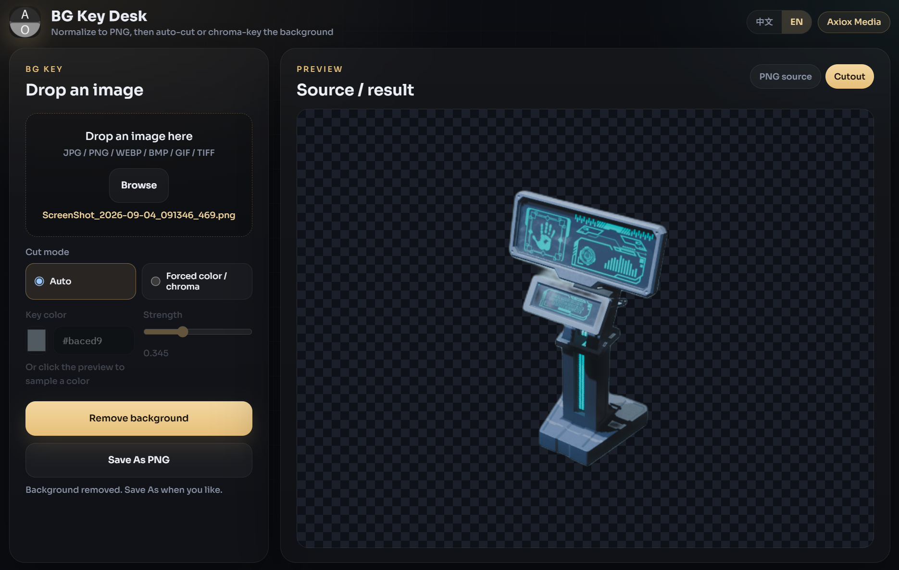

<div align="center">

# BG Key Desk

**由安溯媒体打包**

拖入任意图片，先转成 PNG，再自动掣图或按指定颜色色度键去背景。

<p>
  <a href="../README.md"></a>
</p>

<p>
  <a href="#install">安装</a> ·
  <a href="#features">功能</a> ·
  <a href="#requirements">环境</a> ·
  <a href="#architecture">架构</a> ·
  <a href="#faq">问答</a>
</p>

</div>

<div align="center">
  
</div>

> [!WARNING]
> 推荐用 **[GitHub 部署器](https://github.com/axioxmedia/github-deployer)** 拉取本仓库。未签名 EXE 可能被 SmartScreen 拦截。

---

<a id="install"></a>

## 安装

### 1. GitHub 部署器（推荐）

1. 打开 [GitHub 部署器](https://github.com/axioxmedia/github-deployer)
2. 粘贴本仓库地址：`https://github.com/axioxmedia/Image_Background_Remover`
3. 在应用里阅读 README，再确认部署

这是支持的安装路径。下面的源码 / EXE 步骤只给已经有本地目录的人用。

### 2. 源码运行或打 EXE

```bat
python -m venv .venv
.venv\Scripts\python.exe -m pip install -r requirements.txt
.venv\Scripts\python.exe app.py
```

打窗口版 EXE：安装 Python 3.11 或 3.12（勾选 Add to PATH），双击 `build_exe.bat`，打开 `dist\BgKeyDesk.exe`。

<a id="features"></a>

## 功能

| 项 | 说明 |
|---|---|
| 拖入位图 | JPEG / PNG / WEBP / BMP / GIF 首帧 / TIFF |
| 先转 PNG | 去背景前统一成 8-bit RGBA PNG |
| 自动掣图 | 默认。能加载时走 rembg + u2net |
| 强制颜色 | 取色或点预览取样，强度默认 `0.001`，最大 `1.0` |
| 进度弹窗 | 转换 / 去背景 / 保存都有条 |
| 模型预计时间 | 按这台机器的核数、内存、模型是否已缓存估算 |
| 预览 | 右侧自适应高度，宽度按比例缩放，不拉满 |
| 另存为 | 系统对话框，建议名 `{stem}_nobg.png` |

<a id="requirements"></a>

## 环境

Windows 10/11 跑 EXE。源码需要 Python 3.11 或 3.12。第一次自动掣图要下载 `u2net`。

<a id="architecture"></a>

## 架构

FastAPI 绑在 `127.0.0.1`，静态页 + pywebview 桌面窗。任务进度走 SSE。

<a id="faq"></a>

## 问答

<details>
<summary><strong>第一次自动掣图为什么慢？</strong></summary>

`u2net` 大约 176 MB。第一次可能下载再加载进 ONNX。弹窗倒计时是按这台机器估的，不是固定广告秒数。同进程后续会复用会话。
</details>

<details>
<summary><strong>预览为什么没有铺满右侧？</strong></summary>

v1.1 就是这样：按窗格 contain 缩放，不放大超过 1:1，也不把窄图拉成全宽。
</details>

由安溯媒体打包 · [axiox.media](https://axiox.media)
